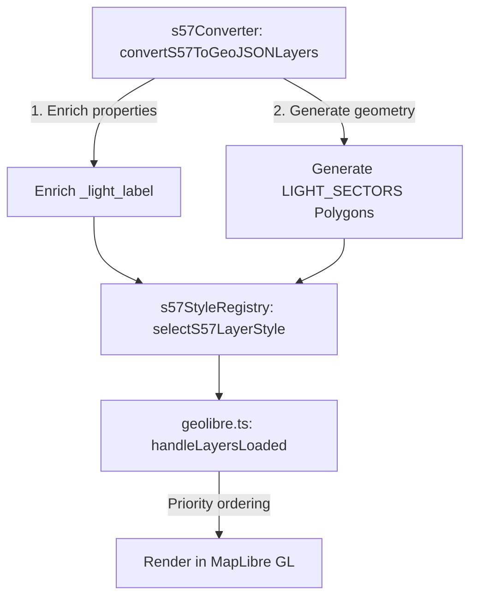

# LIGHTS and Light Sectors Implementation Plan

This document details the implementation plan for updating the S-57 Marine Chart Reader plugin to support the processing, enrichment, rendering, and styling of `LIGHTS` and `LITFLT` features as defined in [Lights.md](file:///c:/Users/erwin/OneDrive/Documents/Learning/Plugin%20000/DOCS/Lights.md) and [Colors.md](file:///c:/Users/erwin/OneDrive/Documents/Learning/Plugin%20000/DOCS/Colors.md).

---

## 1. Overview & Objectives

In standard ENC charting (S-52/S-57), `LIGHTS` features are point symbols that provide visual navigational aid. A complete implementation needs to:
1. **Derive dynamic text labels** (e.g., `Fl(2) WR 5s 15M`) from light characteristics rather than relying only on raw field fallbacks.
2. **Generate sector polygons** (`LIGHT_SECTORS` layer) that project the light's nominal range and angle coverage from the point source.
3. **Provide declarative, priority-based styling** to render light sector polygons underneath point icons/circles with appropriate colors and transparency.

---

## 2. Proposed Changes

We will implement this workflow across the parser converter, styling registry, and host layer loader.



### 2.1. [NEW] `src/lib/utils/lights.ts`
Create a dedicated utility module containing the mathematical projection formulas and formatting lookups.

#### Key Functions:
- **`formatLightLabel(properties: Record<string, any>): string`**
  - Maps `LITCHR` values to abbreviations (e.g., `1` -> `F`, `2` -> `Fl`, `7` -> `Iso`, `8` -> `Oc`, `12` -> `Mo`).
  - Formats `SIGGRP` by wrapping numbers in parentheses (e.g., `2` -> `(2)`) and omitting singular groups (e.g., `1` -> `""`).
  - Maps `COLOUR` code(s) (e.g., `1,3` -> `WR`, `3` -> `R`, `4` -> `G`, `6` -> `Y`).
  - Appends unit suffixes: `SIGPER` (signal period) -> `s` (seconds), `VALNMR` (nominal range) -> `M` (miles).
  - Falls back to `OBJNAM` or `NOBJNM` if the structured attributes are missing or incomplete.
- **`calculateDestinationPoint(lng: number, lat: number, distanceMeters: number, bearingDegrees: number): [number, number]`**
  - Projects coordinates using the spherical destination formula to ensure accurate geodesic mapping.
- **`generateSectorCoordinates(center: [number, number], rangeNm: number, sector1: number, sector2: number): Array<[number, number]>`**
  - Interpolates destination points along the sector arc (typically in 5-degree increments clockwise from `SECTR1` to `SECTR2`).
  - Closes the polygon at the center source coordinates.
- **`generateSectorsForFeature(feature: any): any[]`**
  - Inspects features for `SECTR1` and `SECTR2` attributes.
  - Projects the polygon geometry using `generateSectorCoordinates` and outputs a GeoJSON Polygon feature.

---

### 2.2. [MODIFY] `src/lib/utils/s57Converter.ts`
Integrate the label enrichment and sector generation into the parser grouping flow.

#### Modifications:
- Import `formatLightLabel` and `generateSectorsForFeature` from `./lights`.
- Inside `buildConversionBundleFromGeoJSON`:
  - When encountering `LIGHTS` or `LITFLT` features:
    - Enrich properties with `_light_label = formatLightLabel(props)`.
    - Generate polygon sector features using `generateSectorsForFeature(feature)`.
  - Collect all generated sector features into a single `LIGHT_SECTORS` feature collection.
  - Append the `LIGHT_SECTORS` layer to the conversion bundle's `processedLayers` array:
    ```typescript
    if (sectorFeatures.length > 0) {
      layers.push({
        classCode: 'LIGHT_SECTORS',
        layerName: 'LIGHT_SECTORS',
        fileName,
        metadata: {
          featureCount: sectorFeatures.length,
          sampleProperties: sectorFeatures[0]?.properties ?? {},
          sourcePath: fileName,
          styleHints: {
            objl: 'LIGHT_SECTORS',
            labelField: 'OBJNAM'
          }
        },
        geojson: {
          type: "FeatureCollection",
          features: sectorFeatures
        }
      });
    }
    ```

---

### 2.3. [MODIFY] `src/lib/styles/s57StyleRegistry.ts`
Implement styling configuration and zoom threshold logic.

#### Modifications:
- Add `LIGHT_SECTORS` to the zoom range config:
  - Minimum zoom: `Math.max(purposeRange.minZoom, 9)` (aligned with the point `LIGHTS` layer).
- In `selectS57LayerStyle`, handle `LIGHT_SECTORS`:
  - Priority: `69000` (so it orders below `LIGHTS` at `70000`).
  - Family: `'navigation'`.
  - Apply color rules from `Colors.md` section 2.3:
    - If `COLOUR` contains `'3'` -> `#FF0000` (Red)
    - If `COLOUR` contains `'4'` -> `#00FF00` (Green)
    - Fallback -> `#F2E959` (White/Yellow)
  - Return styling instructions:
    ```typescript
    style: {
      fillColor: color,
      fillOpacity: 0.25,
      strokeColor: color,
      strokeWidth: 1.0
    }
    ```

---

### 2.4. [MODIFY] `src/geolibre.ts`
Ensure the host layer registration correctly maintains priority rendering orders.

#### Modifications:
- Verify that `handleLayersLoaded` sorts layers using the style registry priorities (`LIGHT_SECTORS` at `69000` will be registered right before `LIGHTS` at `70000`), forcing the point circles to render on top of the sector shapes.

---

## 3. Open Questions & Design Options

1. **Buoy/Beacon Lights**: Should we generate sectors for lights on buoys or beacons (e.g. `BOYLAT`, `BCNLAT` features if they hold light sector attributes)?
   - *Recommendation*: Limit sector generation to `LIGHTS` and `LITFLT` objects initially, matching the documentation scope, and extend it later if needed.
2. **All-Around Lights**: If a light does not have `SECTR1`/`SECTR2` attributes, should we generate a full 360-degree sector circle?
   - *Recommendation*: Yes, if a nominal range `VALNMR` is present but sector bounds are missing, generate a full circular polygon to represent the light's visible range.
3. **Day/Dusk/Night Colors**: How should the sector fill opacity and colors adjust in dusk/night modes?
   - *Recommendation*: Use declarative rules inside the styling options. We can reduce the opacity of the sector fills or brighten colors in dark mode.

---

## 4. Verification & Testing Plan

### 4.1. Automated Unit Tests
Add test cases in `tests/lights.test.ts` (or expand `tests/portrayal.test.ts`):
1. **Label Generation Tests**:
   - `Fl(2) WR 5s 15M` for `LITCHR=2`, `SIGGRP=(2)`, `COLOUR=1,3`, `SIGPER=5`, `VALNMR=15`.
   - Fallback to `OBJNAM` if attributes are missing.
2. **Sector Generation Geometry Tests**:
   - Test that destination math yields correct coordinates.
   - Test sector boundary interpolation and verify coordinates start and end at the light's center source.
3. **Style Selection Tests**:
   - Test that `LIGHT_SECTORS` resolves to family `navigation` with correct color mappings and a lower priority than `LIGHTS`.

### 4.2. Manual Verification
1. Load `Samples/S57/ID1N0364.000` in the application uploader.
2. Verify that the layer tree shows `LIGHT_SECTORS` grouped under the ENC file.
3. Visually verify on the map that:
   - Light sectors render as transparent colored fans around point lights.
   - Point symbols remain visible on top of the sectors.
   - Zooming out hides the sectors and labels at the defined zoom thresholds.
