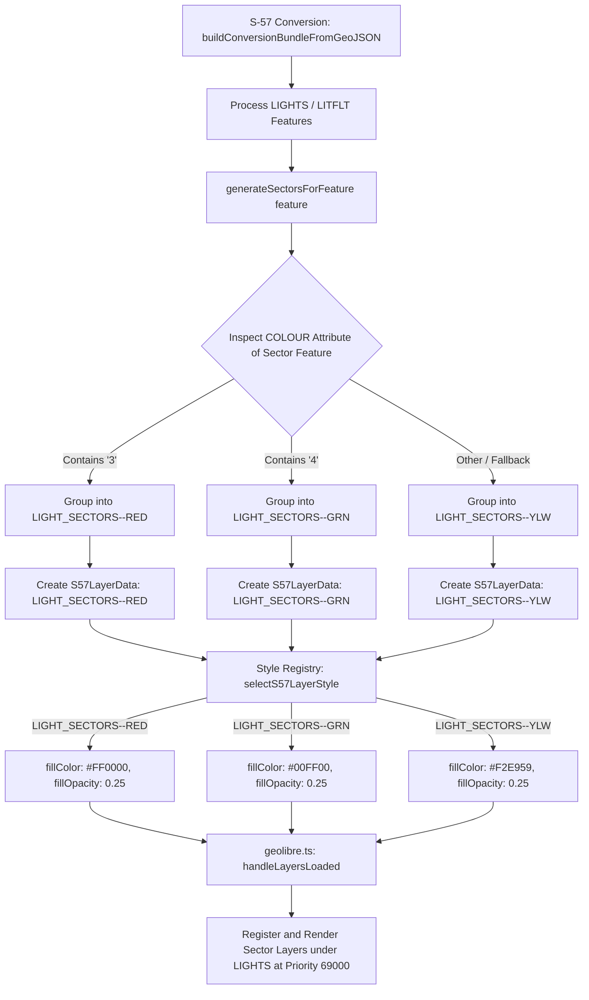

# Implementation Plan: Split LIGHT_SECTORS Processed Layers by Colour

## Purpose
Update the S-57 Marine Chart Reader plugin so that `LIGHT_SECTORS` processed layers are split into color-specific layers (`LIGHT_SECTORS--RED`, `LIGHT_SECTORS--GRN`, `LIGHT_SECTORS--YLW`), matching the color splitting behavior of their raw data `LIGHTS` counterpart (`LIGHTS--RED`, `LIGHTS--GRN`, `LIGHTS--YLW`), and ensuring each sector layer is styled accordingly with S-52 standard colors and transparency.

## Scope
- **Converter Engine (`src/lib/utils/s57Converter.ts`)**: Group generated light sector polygon features by color suffix (`--RED`, `--GRN`, `--YLW`) determined from the `COLOUR` attribute of each sector feature, emitting separate `S57LayerData` objects for each non-empty color group.
- **Style Registry (`src/lib/styles/s57StyleRegistry.ts`)**: Update `selectS57LayerStyle`, `getLayerZoomRange`, and `buildLightSectorStyle` to support color-suffixed class/layer names (`LIGHT_SECTORS--RED`, `LIGHT_SECTORS--GRN`, `LIGHT_SECTORS--YLW`), mapping each to its respective S-52 color token (#FF0000 red, #00FF00 green, #F2E959 yellow/white fallback), priority (69000), and zoom range (minZoom 9).
- **Plugin Host Integration (`src/geolibre.ts`)**: Update `handleLayersLoaded` to queue all derived `LIGHT_SECTORS` color layers for a file in `pendingDerived` so they are inserted into MapLibre in proper sequence before the point `LIGHTS` layer stack.
- **Automated Tests (`tests/`)**: Add unit test coverage in `tests/lights.test.ts`, `tests/s57StyleRegistry.test.ts`, and `tests/groupByFile.test.ts` for color-split sector layers, geometry, style selection, priority, and layer registration.

---

## Technical Architecture & Workflow



---

## Proposed Changes

### 1. Converter Engine

#### [MODIFY] [s57Converter.ts](file:///c:/Users/erwin/OneDrive/Documents/Learning/Plugin%20000/S57Convert/src/lib/utils/s57Converter.ts)
- Replace the single `sectorFeatures: any[] = []` array with a color-grouped record:
  ```typescript
  const sectorFeaturesByColor: Record<string, any[]> = {
    '--RED': [],
    '--GRN': [],
    '--YLW': [],
  };
  ```
- When `generateSectorsForFeature(feature)` produces sector polygon features:
  - For each generated sector feature, inspect `feature.properties.COLOUR`:
    ```typescript
    const color = String(secFeature.properties?.COLOUR || '');
    let secSuffix = '--YLW';
    if (color.includes('3')) secSuffix = '--RED';
    else if (color.includes('4')) secSuffix = '--GRN';
    sectorFeaturesByColor[secSuffix].push(secFeature);
    ```
- When creating processed layers for `LIGHT_SECTORS`:
  - Iterate through the keys of `sectorFeaturesByColor` (`--RED`, `--GRN`, `--YLW`):
  - For any non-empty group, create a layer object:
    ```typescript
    Object.entries(sectorFeaturesByColor).forEach(([secSuffix, features]) => {
      if (features.length === 0) return;
      const layerName = `LIGHT_SECTORS${secSuffix}`;
      layers.push({
        classCode: 'LIGHT_SECTORS',
        layerName: layerName,
        fileName,
        metadata: {
          featureCount: features.length,
          sampleProperties: features[0]?.properties ?? {},
          sourcePath: fileName,
          styleHints: {
            objl: 'LIGHT_SECTORS',
            labelField: 'OBJNAM',
          },
        },
        geojson: {
          type: 'FeatureCollection',
          features,
        },
      });
    });
    ```

---

### 2. Style Registry & Palette Rules

#### [MODIFY] [s57StyleRegistry.ts](file:///c:/Users/erwin/OneDrive/Documents/Learning/Plugin%20000/S57Convert/src/lib/styles/s57StyleRegistry.ts)
- Update `getLayerZoomRange`:
  - Ensure zoom range check handles color-suffixed `LIGHT_SECTORS` class/layer names:
    ```typescript
    if (normalizedCode === 'LIGHT_SECTORS' || normalizedCode.startsWith('LIGHT_SECTORS--')) {
      return { minZoom: Math.min(purposeRange.minZoom, 9), maxZoom: purposeRange.maxZoom };
    }
    ```
    - This means sectors appear at zoom 0 in overview charts (purpose 1, minZoom=0) and are capped at zoom 9 for high-purpose detail charts.
- Update `buildLightSectorStyle`:
  - Allow resolving color from layer name / class code suffix as well as feature `COLOUR` attributes:
    ```typescript
    function buildLightSectorStyle(attributes: Record<string, unknown>, layerNameOrClass?: string): GeoLibreNativeLayerStyle {
      const colString = asString(attributes.COLOUR) ?? '';
      const nameUpper = String(layerNameOrClass || '').toUpperCase();

      let color = '#F2E959'; // default yellow/white fallback
      if (colString.includes('3') || nameUpper.includes('--RED')) {
        color = '#FF0000';
      } else if (colString.includes('4') || nameUpper.includes('--GRN')) {
        color = '#00FF00';
      }

      return {
        fillColor: color,
        fillOpacity: 0.25,
        strokeColor: color,
        strokeWidth: 1.0,
      };
    }
    ```
- Update `selectS57LayerStyle`:
  - Match `normalizedCode === 'LIGHT_SECTORS' || normalizedCode.startsWith('LIGHT_SECTORS--')`:
    ```typescript
    if (normalizedCode === 'LIGHT_SECTORS' || normalizedCode.startsWith('LIGHT_SECTORS--')) {
      return {
        family: 'navigation',
        priority: 69000,
        minZoom: zoomRange.minZoom,
        maxZoom: zoomRange.maxZoom,
        style: buildLightSectorStyle(normalizedAttributes, normalizedCode),
      };
    }
    ```

---

### 3. Plugin Host Integration

#### [MODIFY] [geolibre.ts](file:///c:/Users/erwin/OneDrive/Documents/Learning/Plugin%20000/S57Convert/src/geolibre.ts)
- Update `pendingDerived` tracking in `handleLayersLoaded`:
  - Store an array of sector layers per file key: `pendingDerived: Map<string, S57LayerData[]>` for `${l.fileName}::LIGHT_SECTORS`.
- When encountering `layer.classCode === 'LIGHTS'`:
  - Retrieve all pending sector layers for `${layer.fileName}::LIGHT_SECTORS`.
  - Add each sector layer (`LIGHT_SECTORS--RED`, `LIGHT_SECTORS--GRN`, `LIGHT_SECTORS--YLW`) to GeoLibre via `addGeoJsonLayer`, apply its respective style via `selectS57LayerStyle`, and track in `everyloadedlayers` and `layerIds`.
  - Remove consumed entry from `pendingDerived`.

---

## Verification Plan

### Automated Tests
- Run full test suite:
  ```bash
  npm test
  ```
- Add / Update unit tests in `tests/lights.test.ts` and `tests/s57StyleRegistry.test.ts`:
  1. **Converter Layer Splitting**: Test `buildConversionBundleFromGeoJSON` with a mock S-57 GeoJSON containing red (`COLOUR: '3'`), green (`COLOUR: '4'`), and yellow (`COLOUR: '1'`) lights with sector attributes (`SECTR1`, `SECTR2`). Verify `processedLayers` contains `LIGHT_SECTORS--RED`, `LIGHT_SECTORS--GRN`, and `LIGHT_SECTORS--YLW`.
  2. **Style Registry Color Resolution**: Test `selectS57LayerStyle('LIGHT_SECTORS--RED')`, `selectS57LayerStyle('LIGHT_SECTORS--GRN')`, and `selectS57LayerStyle('LIGHT_SECTORS--YLW')` to confirm they resolve to `#FF0000`, `#00FF00`, and `#F2E959` with priority `69000` and `fillOpacity` `0.25`.
  3. **File Grouping & Layer Cleanup**: Verify in `tests/groupByFile.test.ts` that deleting a file cleans up all `LIGHT_SECTORS--*` layers associated with that file.

### Manual Verification
1. Run local dev server (`npm run dev`).
2. Upload chart file containing multi-colored sector lights (e.g., `Samples/S57/ID1N0364.000`).
3. Verify on the map that:
   - Red sectors render with semi-transparent red fill (`#FF0000`).
   - Green sectors render with semi-transparent green fill (`#00FF00`).
   - White/Yellow sectors render with semi-transparent yellow fill (`#F2E959`).
   - Point `LIGHTS` symbols remain rendered on top of the sector fans.
